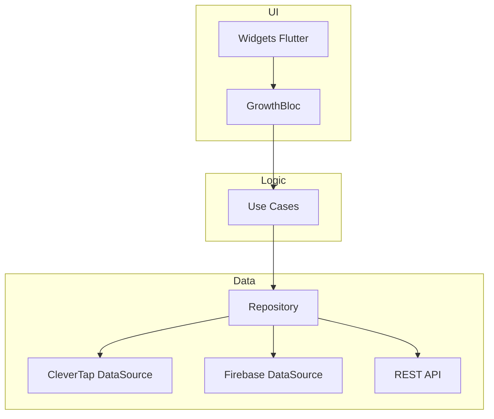
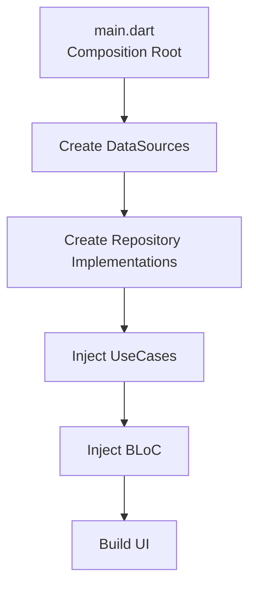
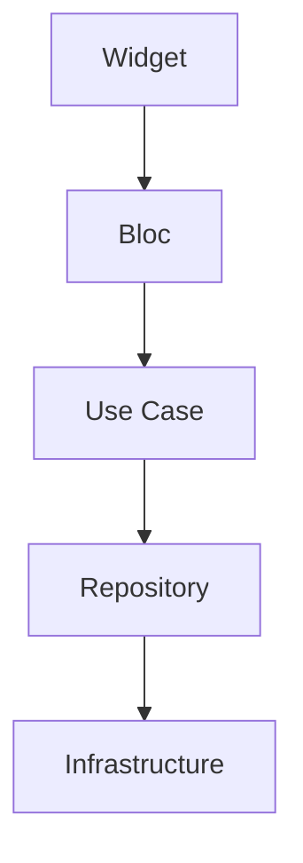
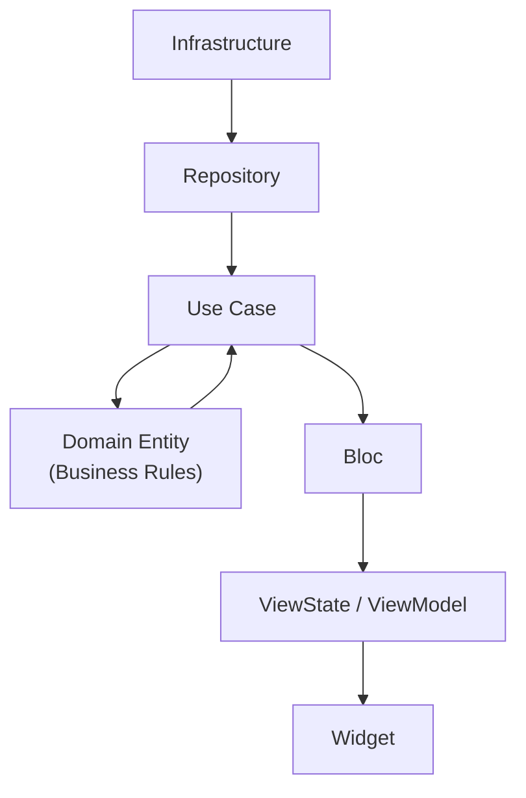

# 🚀 GrowthLab Productivity

**GrowthLab Productivity** es un MVP desarrollado en Flutter que demuestra implementación profesional de:

- Clean Architecture
- Patrón BLoC
- Integración con CleverTap SDK
- Separación estricta de responsabilidades
- Diseño preparado para escalar

---

## 🏗️ Arquitectura y Principios de Diseño

El proyecto sigue una separación estricta de responsabilidades para garantizar testabilidad y escalabilidad, **Clean Architecture basada en capas (layered approach)**:

La decisión de organizar por capas globales es intencional:  
para un **MVP**, esta estructura permite claridad, rapidez de iteración y bajo acoplamiento sin introducir complejidad prematura.

## 📂 Estructura Actual (Layered)

```bash
lib/
│
├── domain/
│   ├── entities/
│   ├── repositories/
│   └── usecases/
│
├── data/
│   ├── datasources/
│   └── repositories/
│
└── presentation/
    ├── bloc/
    ├── pages/
    └── navigation/

```

- **Domain Layer:** Entidades puras y lógica de negocio.
- **Data Layer:** Repositorios y DataSources (CleverTap, Firebase, REST).
- **Presentation Layer:** Gestión de estado reactiva mediante **BLoC** y UI moderna con **Material 3**.



### 🔹 Domain

- Contiene las reglas del negocio:
- Entidades inmutables
- Casos de uso (UseCases)
- Contratos (interfaces de repositorio)
- Sin dependencias de Flutter ni SDKs externos
- El dominio es independiente de la infraestructura.

### 🔹 Data

- Implementación concreta de los contratos definidos en domain/:
- Integración con CleverTap
- Firebase / Remote Config
- Adaptación de datos externos a modelos de dominio
- Fallbacks seguros ante fallos de red
- La infraestructura nunca expone datos inválidos al dominio.

### 🔹 Presentation

- Capa responsable de estado y UI:
- BLoC como coordinador
- Eventos y estados inmutables (Equatable)
- Sin acceso directo a SDKs
- La UI no conoce detalles de infraestructura.

## 🎯 Objetivo

Demostrar:

- Diseño arquitectónico sólido
- Integración limpia con SDKs externos
- Separación profesional de capas
- Preparación real para escalamiento

## 📌 Estado

- MVP funcional
- Preparado para modularización feature-first
- Sin deuda estructural crítica
  
---

## 🏗 Principios Aplicados

- Inversión de dependencias
- Entidades inmutables
- Casos de uso como orquestadores
- Infraestructura desacoplada
- Estados previsibles (BLoC + Equatable)
- Fallbacks seguros ante fallas externas

## El flujo de configuración- creación

Este flujo Ocurre **una sola vez**, al iniciar la app:



 📌 Características

- Se construyen implementaciones concretas.
- Se inyectan dependencias hacia capas internas.
- No hay llamadas de negocio.
- No hay lógica de dominio ejecutándos
- Este flujo existe únicamente para cumplir la Dependency Rule

## El flujo real de Llamadas en runtime

Este flujo ocurre cada vez que el usuario interactúa con la aplicación.

### 1️⃣ Flujo descendente (request flow)



1. El usuario dispara un evento.
2. El BLoC ejecuta un Use Case.
3. El Use Case invoca el repositorio (contrato del dominio).
4. La infraestructura ejecuta la operación real.

### 2️⃣ Flujo ascendente (response flow)



1. La infraestructura retorna datos.
2. El repositorio los adapta al dominio.
3. El dominio aplica reglas e invariantes.
4. El resultado se transforma en estado de presentación.
5. La UI se actualiza.

## 🧠 Principio Clave

El dominio nunca “va” a buscar datos.
Los datos siempre son inyectados hacia él.

Esto garantiza:

- Inversión de dependencias
- Testabilidad
- Independencia de frameworks
- Sustitución de infraestructura sin impacto en negocio

## 🎯 Cumplimiento de Requisitos Inamovibles

### 1. Gestión de Perfil (CleverTap)
- **Llaves Exactas:** `Name`, `Identity`, `Email`, `Phone`.
- **Identity:** Validado como string numérico puro (sin puntos ni caracteres especiales).
- **Ambiente:** Integrado con el Sandbox `TEST-MOVii`.

### 2. Event Tracking
- **Evento:** `Hola_mundo` (Exacto).
- **Propiedades:** `years_mobile_experience`, `years_flutter_experience`, `published_apps`.

### 3. Operaciones Asíncronas y Performance
- **Sync Global:** Implementación de proceso de 7 segundos con bloqueo preventivo de UI.
- **Eficiencia:** Renderizado dinámico de hasta 400 elementos mediante `ListView.builder` para optimización de memoria.

---

## 🛠️ Stack Técnico

- **Flutter SDK:** Latest Stable.
- **Manejo de Estado:** `flutter_bloc`.
- **Engagement:** `clevertap_plugin`.
- **Backend:** Firebase (Remote Config & Firestore).
- **Asincronía:** Futures, Streams y Async/Await.

---

## ⚙️ Configuración y Ejecución

1. **Dependencias:** Ejecute `flutter pub get`.
1. **Android/iOS:** Asegure la configuración de `google-services.json` y los permisos de CleverTap en `AndroidManifest.xml` / `Info.plist`.
1. **Ambiente:** El SDK está configurado para apuntar al Dashboard de QA (Sandbox).

---

## 🔐 Configuración Firebase (Android / iOS / Web)

Este repositorio incluye uso de Firestore, Remote Config y Storage. Para que los servicios funcionen en Android/iOS, debe provisionar las credenciales de Firebase en cada plataforma.

1. Generar `firebase_options.dart` (recomendado):

```bash
dart pub global activate flutterfire_cli
flutterfire configure --project="<your-project-id>"
```

2. Alternativa (Android/iOS manual):
    - Desde Firebase Console descargue `google-services.json` y colóquelo en `android/app/`.
    - Desde Firebase Console descargue `GoogleService-Info.plist` y colóquelo en `ios/Runner/`.

3. Remote Config:
    - `lib/data/datasources/firebase_datasource.dart` ya inicializa `FirebaseRemoteConfig` y aplica `fetchAndActivate()`.
    - Defina parámetros por defecto en el código o configure en la consola de Firebase para producción/QA.

4. Storage:
    - Añadido `lib/data/datasources/firebase_storage_datasource.dart` con helpers `uploadBytes` y `getDownloadUrl`.
    - Use `AnalyticsRepository.uploadProfilePhoto(...)` para subir imágenes y obtener URL.

5. App Distribution (nota):
    - App Distribution requiere configurar el plugin de Gradle en Android y subir builds desde Firebase CLI o Fastlane.
    - No se incluyen credenciales públicas en este repositorio; siga la guía oficial: https://firebase.google.com/products/app-distribution

---

## 🧪 Cómo probar localmente (tests y ejecución)

Pasos rápidos para reproducir el entorno y validar requisitos automáticamente:

1. Instale dependencias:

```bash
flutter pub get
```

2. Ejecutar análisis estático:

```bash
flutter analyze
```

3. Ejecutar tests unitarios/widget (incluye el widget smoke test):

```bash
flutter test --coverage
```

4. Ejecutar en dispositivo Android conectado:

```bash
flutter run -d android
```

---

## 🔌 Integración CleverTap (estado actual y cómo habilitar el SDK real)

- Estado actual: el repositorio contiene un wrapper Dart estable en `lib/data/datasources/clevertap_datasource.dart` que utiliza `MethodChannel('clevertap_plugin')` para invocar la implementación nativa. Esto permite ejecutar tests y la app en entornos donde el plugin nativo no esté presente (fallback con logging y latencia simulada).

- Credenciales de Sandbox: colocadas en `android/local.properties` como `CLEVERTAP_ACCOUNT_ID`, `CLEVERTAP_TOKEN`, `CLEVERTAP_REGION`.

- Para usar directamente el plugin oficial (`clevertap_plugin`) en lugar del MethodChannel, reemplazar el contenido de `lib/data/datasources/clevertap_datasource.dart` por llamadas al SDK. Ejemplo mínimo:

```dart
import 'package:clevertap_plugin/clevertap_plugin.dart';

class CleverTapDataSource {
    Future<void> onUserLogin(UserProfile profile) async {
        CleverTapPlugin.onUserLogin({
            'Name': profile.name,
            'Identity': profile.identity,
            'Email': profile.email,
            'Phone': profile.phone,
        });
    }

    Future<void> profilePush(String identity, Map<String, dynamic> attrs) async {
        CleverTapPlugin.profilePush(attrs);
    }

    Future<void> trackEvent(String name, Map<String, dynamic> props) async {
        CleverTapPlugin.recordEvent(name, props: props);
    }
}
```

## 📈 Escalabilidad: Evolución a Feature-First

Aunque el MVP está organizado por capas globales, la arquitectura permite migrar fácilmente a una estructura feature-first sin reescribir lógica de negocio.

```bash
Estructura futura esperada
lib/
├── features/
│   ├── onboarding/
│   │   ├── domain/
│   │   ├── data/
│   │   └── presentation/
│   │
│   ├── analytics/
│   │   ├── domain/
│   │   ├── data/
│   │   └── presentation/
│
└── shared/
    └── core/
```

## Beneficios del enfoque feature-first

- Encapsulamiento por módulo
- Mejor mantenibilidad en productos grandes
- Escalabilidad por equipo
- Reducción de acoplamiento horizontal
- La migración sería organizacional, no conceptual.
- Clean Architecture se mantiene intacta.

---
