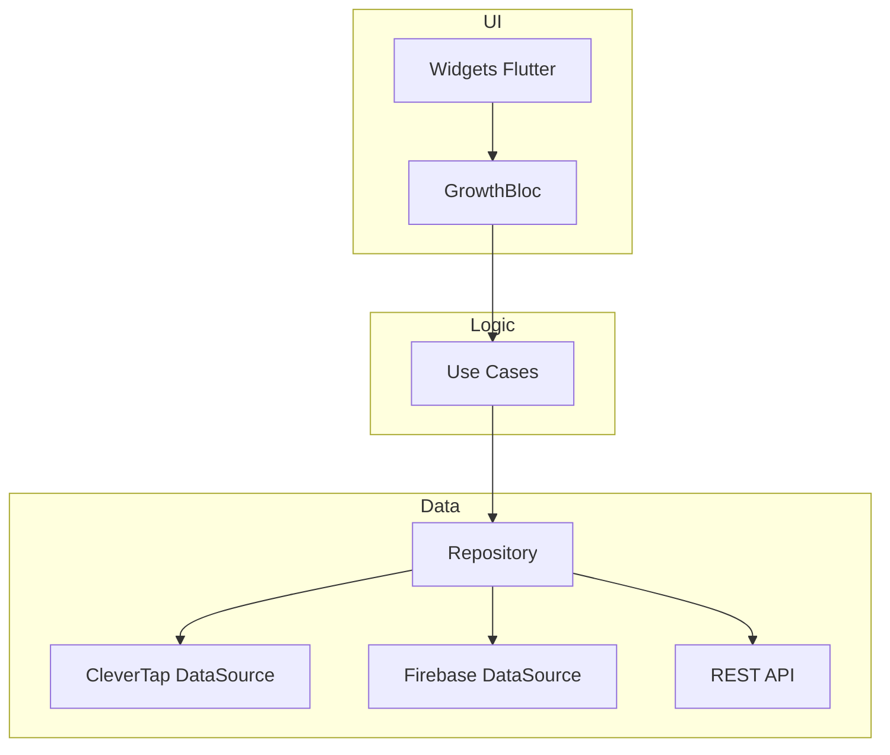

# 🚀 GrowthLab Productivity
### Senior Flutter Engineering Technical Assessment

**GrowthLab Productivity** es una solución robusta diseñada para demostrar dominio senior en el ecosistema Flutter, aplicando **Clean Architecture**, el patrón **BLoC** e integración profesional con **CleverTap SDK**.

---

## 🏗️ Arquitectura y Principios de Diseño

El proyecto sigue una separación estricta de responsabilidades para garantizar testabilidad y escalabilidad:

- **Domain Layer:** Entidades puras y lógica de negocio.
- **Data Layer:** Repositorios y DataSources (CleverTap, Firebase, REST).
- **Presentation Layer:** Gestión de estado reactiva mediante **BLoC** y UI moderna con **Material 3**.



---

## 🎯 Cumplimiento de Requisitos Inamovibles

### 1. Gestión de Perfil (CleverTap)
- **Llaves Exactas:** `Name`, `Identity`, `Email`, `Phone`.
- **Identity:** Validado como string numérico puro (sin puntos ni caracteres especiales).
- **Ambiente:** Integrado con el Sandbox `TEST-MOVii`.

### 2. Event Tracking
- **Evento:** `Hola_mundo` (Exacto).
- **Propiedades:** `years_mobile_experience`, `years_flutter_experience`, `published_apps`.

### 3. Operaciones Asíncronas y Performance
- **Sync Global:** Implementación de proceso de 7 segundos con bloqueo preventivo de UI.
- **Eficiencia:** Renderizado dinámico de hasta 400 elementos mediante `ListView.builder` para optimización de memoria.

---

## 🛠️ Stack Técnico

- **Flutter SDK:** Latest Stable.
- **Manejo de Estado:** `flutter_bloc`.
- **Engagement:** `clevertap_plugin`.
- **Backend:** Firebase (Remote Config & Firestore).
- **Asincronía:** Futures, Streams y Async/Await.

---

## ⚙️ Configuración y Ejecución

1. **Dependencias:** Ejecute `flutter pub get`.
1. **Android/iOS:** Asegure la configuración de `google-services.json` y los permisos de CleverTap en `AndroidManifest.xml` / `Info.plist`.
1. **Ambiente:** El SDK está configurado para apuntar al Dashboard de QA (Sandbox).

---

### Senior Reviewer Note

Esta implementación ha sido auditada para garantizar que no existan desviaciones arquitectónicas ni inconsistencias en el formato de datos enviado a los servicios de engagement.

---

## 🧪 Cómo probar localmente (tests y ejecución)

Pasos rápidos para reproducir el entorno y validar requisitos automáticamente:

1. Instale dependencias:

```bash
flutter pub get
```

1. Ejecutar análisis estático:

```bash
flutter analyze
```

1. Ejecutar tests unitarios/widget (incluye el widget smoke test):

```bash
flutter test --coverage
```

1. Ejecutar en dispositivo Android conectado:

```bash
flutter run -d android
```

---

## 🔌 Integración CleverTap (estado actual y cómo habilitar el SDK real)

- Estado actual: el repositorio contiene un wrapper Dart estable en `lib/data/datasources/clevertap_datasource.dart` que utiliza `MethodChannel('clevertap_plugin')` para invocar la implementación nativa. Esto permite ejecutar tests y la app en entornos donde el plugin nativo no esté presente (fallback con logging y latencia simulada).

- Credenciales de Sandbox: colocadas en `android/local.properties` como `CLEVERTAP_ACCOUNT_ID`, `CLEVERTAP_TOKEN`, `CLEVERTAP_REGION`.

- Para usar directamente el plugin oficial (`clevertap_plugin`) en lugar del MethodChannel, reemplazar el contenido de `lib/data/datasources/clevertap_datasource.dart` por llamadas al SDK. Ejemplo mínimo:

```dart
import 'package:clevertap_plugin/clevertap_plugin.dart';

class CleverTapDataSource {
    Future<void> onUserLogin(UserProfile profile) async {
        CleverTapPlugin.onUserLogin({
            'Name': profile.name,
            'Identity': profile.identity,
            'Email': profile.email,
            'Phone': profile.phone,
        });
    }

    Future<void> profilePush(String identity, Map<String, dynamic> attrs) async {
        CleverTapPlugin.profilePush(attrs);
    }

    Future<void> trackEvent(String name, Map<String, dynamic> props) async {
        CleverTapPlugin.recordEvent(name, props: props);
    }
}
```

> Nota: después de cambiar a llamadas directas al plugin, ejecute `flutter clean` y `flutter pub get`, luego pruebe en un dispositivo real o emulador con los servicios nativos disponibles.

---

Si quieres, aplico la conversión automática del wrapper para usar `package:clevertap_plugin` (haría el cambio en `lib/data/datasources/clevertap_datasource.dart` y validaría `flutter analyze`/`flutter test`).
