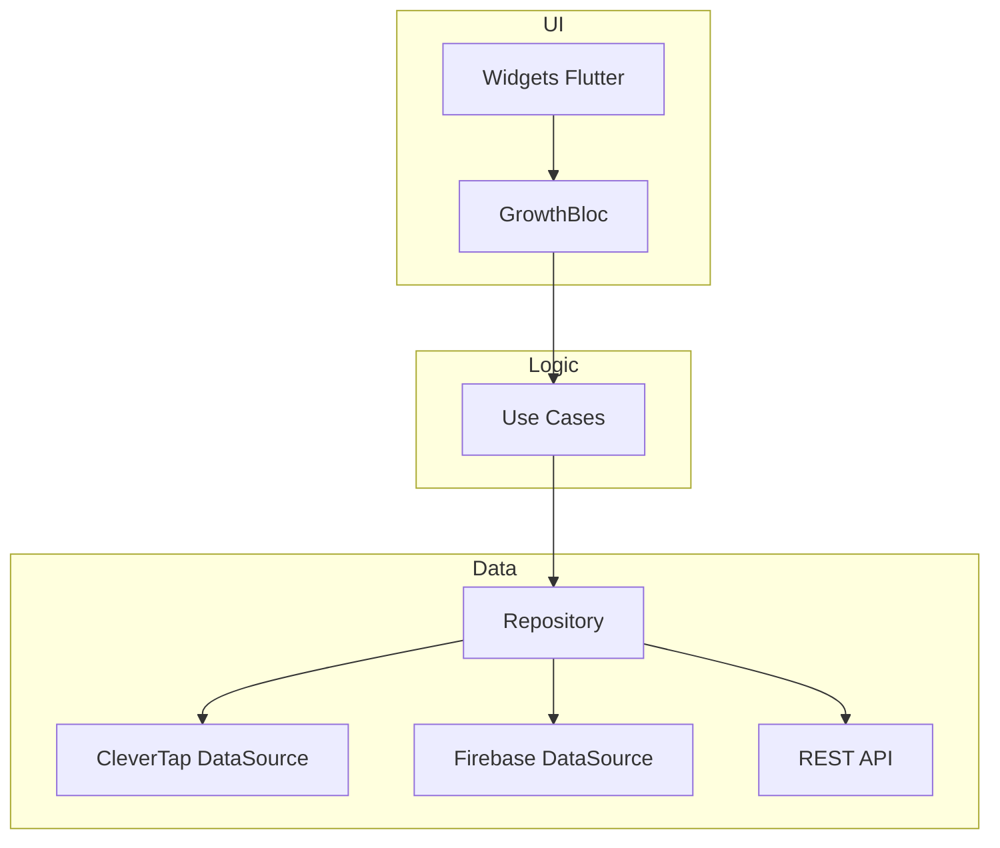

# 🚀 GrowthLab Productivity
### Senior Flutter Engineering Technical Assessment

**GrowthLab Productivity** es una solución robusta diseñada para demostrar dominio senior en el ecosistema Flutter, aplicando **Clean Architecture**, el patrón **BLoC** e integración profesional con **CleverTap SDK**.

---

## 🏗️ Arquitectura y Principios de Diseño

El proyecto sigue una separación estricta de responsabilidades para garantizar testabilidad y escalabilidad:

- **Domain Layer:** Entidades puras y lógica de negocio.
- **Data Layer:** Repositorios y DataSources (CleverTap, Firebase, REST).
- **Presentation Layer:** Gestión de estado reactiva mediante **BLoC** y UI moderna con **Material 3**.

---

## 🎯 Cumplimiento de Requisitos Inamovibles

### 1. Gestión de Perfil (CleverTap)
- **Llaves Exactas:** `Name`, `Identity`, `Email`, `Phone`.
- **Identity:** Validado como string numérico puro (sin puntos ni caracteres especiales).
- **Ambiente:** Integrado con el Sandbox `TEST-MOVii`.

### 2. Event Tracking
- **Evento:** `Hola_mundo` (Exacto).
- **Propiedades:** `years_mobile_experience`, `years_flutter_experience`, `published_apps`.

### 3. Operaciones Asíncronas y Performance
- **Sync Global:** Implementación de proceso de 7 segundos con bloqueo preventivo de UI.
- **Eficiencia:** Renderizado dinámico de hasta 400 elementos mediante `ListView.builder` para optimización de memoria.

---

## 🛠️ Stack Técnico

- **Flutter SDK:** Latest Stable.
- **Manejo de Estado:** `flutter_bloc`.
- **Engagement:** `clevertap_plugin`.
- **Backend:** Firebase (Remote Config & Firestore).
- **Asincronía:** Futures, Streams y Async/Await.

---

## ⚙️ Configuración y Ejecución

1.  **Dependencias:** Ejecute `flutter pub get`.
2.  **Android/iOS:** Asegure la configuración de `google-services.json` y los permisos de CleverTap en `AndroidManifest.xml` / `Info.plist`.
3.  **Ambiente:** El SDK está configurado para apuntar al Dashboard de QA (Sandbox).

---
**Senior Reviewer Note:** Esta implementación ha sido auditada para garantizar que no existan desviaciones arquitectónicas ni inconsistencias en el formato de datos enviado a los servicios de engagement.
